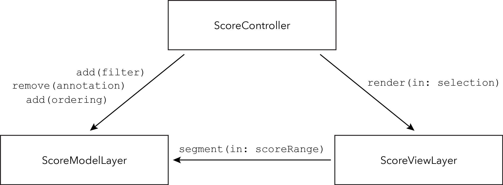

# Architecture

The architecture of the **dn-m** iPad application follows the Model-View-Controller pattern.
 
- `AbstractMusicalModel` 
- [`ScoreModelLayer`](ScoreModelLayer.md)
- [`ScoreViewLayer`](ScoreViewLayer.md)
- [`ScoreController`](ScoreController.md)

## Organizational diagram

