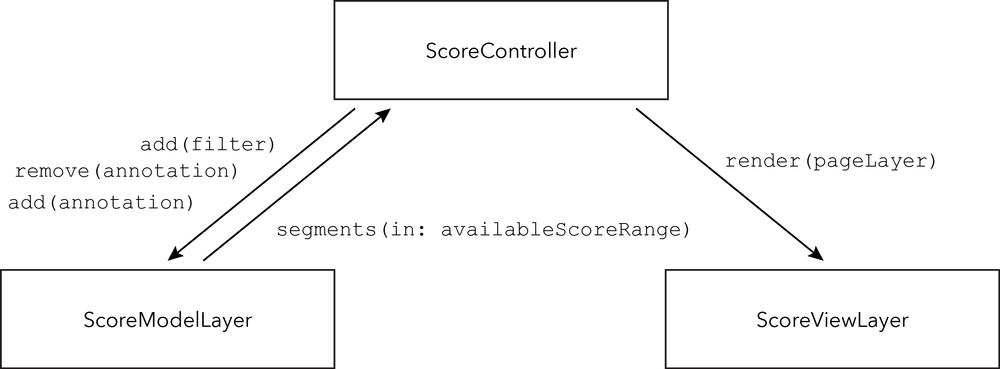

# Architecture

## Model Layer

The model layer encapsulates abstract information of a work of music, as well as user-defined modifications it.

For example, a performer may select to **filter** out any given attribute of any part on the score. Furthermore, they may add a number of different types of **annotations**. The model layer stores these modifications abstractly, and presents an updated model of the score model.

The only product of the model layer is a `ScoreModelSegment`, which is an abstract representation of the graphical objects comprising a `System`'s-worth of music. That is, the objects contained within the `ScoreModelSegment` are knowledgeable of "musical time", and not their horizontal placement.

This product will in turn be transformed into a `System` by the `ScoreViewLayer`.

```Swift

final class ScoreModelLayer {

    // MARK: - Nested Types

    /// Abstract representation of graphical objects of a System's worth of music.
    /// Extends the ScoreModel with a model of managing Spanner type objects over System-breaks.
    /// Objects contained herein are organized in "time", not in horizontal space.
    /// This is the only public product of the `ScoreModelLayer`.
    struct ScoreModelSegment {

    	init(scoreModel: ScoreModel, range: ScoreRange) {
    		...
    	}

    	func filtered(with filters: FilterState) -> ScoreModelSegment {
    		...
    	}

    	/// - returns: Copy of self with annotations merged
        func annotated(with annotations: AnnotationModel) -> ScoreModelSegment {
            ...
        }
    }

    /// Abstract representation of graphical objects comprising a full score.
    /// This model has no knowledge of system breaks.
    /// Objects contained herein are organized in "time", not in horizontal space.
    private class ScoreModel {

        init(_ abstractMusicalModel: AbstractMusicalModel) {
            ...
        }

		/// - returns: Subset of `self` in a given range.
        func segment(in range: ScoreRange) -> ScoreModelSegment {
        	...
        }

        /// - returns: Subset of `self` in a given range, with the given `annotations` merged.
        func segment(in range: ScoreRange, annotations: AnnotationModel, filters: FilterModel) 
        	-> ScoreModelSegment 
        {
            return segment(in: range)
            	.annotated(with: annotations)
            	.filtered(with: filters)
        }
    }

    /// Data structure holding overlapping ranges of filters (hide c for a:b in (t0,t1)).
    private struct FilterModel {
        let backingModel: ...
        func add(_ filter: Filter) { }
        func remove(_ filter: Filter) { }
    }

    /// Data structure holding annotations (bowings, fingerings, cue links).
    private struct AnnotationModel {
        let backingModel: ...
        func add(_ filter: Annotation) { }
        func remove(_ filter: Annotation) { }
    }

    /// Reads and writes persisting user state from/to disk on background thread.
    private struct DataStore {
        func writeToFilterDataStore() { }
        func readFromFilterDataStore() { }
        func writeToAnnotationDataStore() { }
        func readFromAnnotationDataStore() { }
    }

    // MARK: - Instance Properties

    private var filters: FilterModel
    private var annotations: AnnotationModel
    private let dataStore: DataStore
    private let scoreModel: ScoreModel

    // MARK: - Initializers

    init(abstractMusicalModel: AbstractMusicalModel) {
        self.scoreModel = ScoreModel(abstractMusicalModel)
    }

    // MARK: - Instance Methods

    func scoreModelSegment(in range: ScoreRange) -> ScoreModelSegment {
        return scoreModel.segment(in: range, annotations: annotations, filters: filters)
    }

    // MARK: - Modifying Model

    func add(_ filter: Filter) {
        filters.add(filter)
        writeToFilterDataStore()
    }

    func remove(_ filter: Filter) { 
        filters.remove(filter)
        writeToFilterDataStore()
    }

    func add(_ annotation: Annotation) { 
        annotations.add(annotation)
        writeToAnnotationDataStore()
    }

    func remove(_ filter: Annotation) { 
        annotations.remove(annotation)
        writeToAnnotationDataStore()
    }
}
```



---

## Input

Several input methods are to be developed.

### dn-m language

For the purposes of authoring scores efficiently, a language is to be developed.

**TODO**: dn-m language definition page

### MusicXML conversion

For the purposes of translating previously authored scores into the dn-m environment, the [MusicXML](https://github.com/dn-m/MusicXML) framework will convert the abstract musical information from `MusicXML` files to the native `dn-m` `Abstract Musical Model` representation.

---

## Static Model

Before being represented graphically, the musical information of a score will go through several internal representations.

### Abstract Musical Model

The abstract musical model will hold abstract definitions of musical events, agnostic of graphical representation.

The current implementation (which can be revised considerably) looks like this:

```Swift
final class AbstractMusicModel {
	let measures: [Measure]
	let events: [ContextualizedEventTree]
}
```

### Intermediate Representations

Depending on the specific types of information, there may be different intermediate representations to appropriately prepare them for score organization.

### Score Model

The Score Model is modeled as a single (lazy) stream

Agnostic to:
- Horizontal / vertical dimensions
- Score order
- Splitting up of Spanner types

---

## Dynamic Generated Representational Model

### User Configuration

A performer-user can configure the score representation in two ways.

#### Dimensional

Scale the concrete dimensions of the score to be bigger or smaller

#### Semantic

Filter out attributes of any performers' part.

### Score Model Segment

A subsequence of the contents of the Score Model, taking into consideration system breaks, and therefore the splitting up of `Spanner` types.
