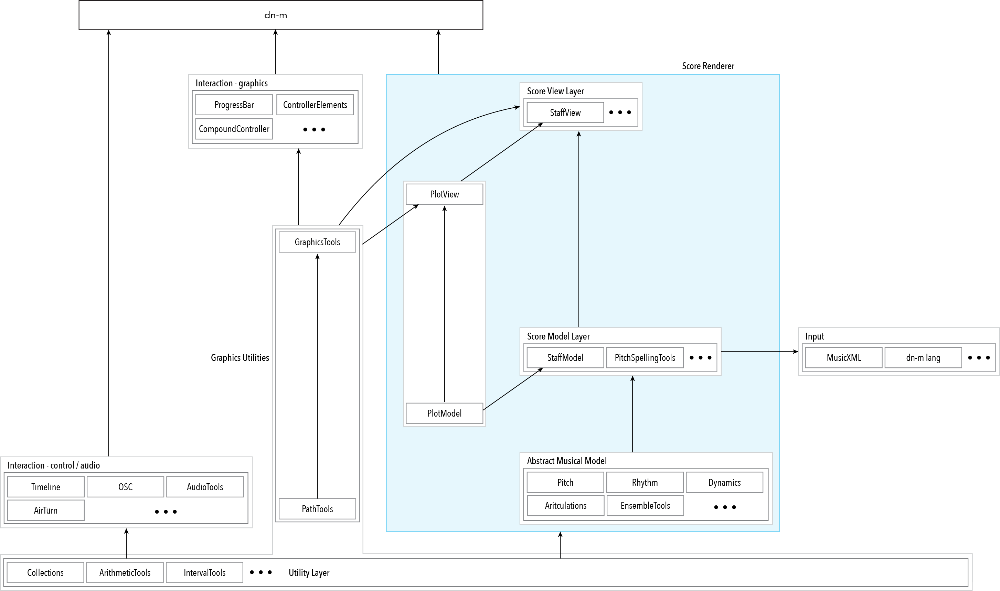

# Organizational Layers

### Application Layer

- [`dn-m`](https://github.com/dn-m/dn-m)

### Real-time Layer

The frameworks of this layer contain their source, and demo targets for graphical confirmation.

- [`Timeline`](https://github.com/dn-m/Timeline)
- [`OSC`](https://github.com/dn-m/OSC)
- [`AudioTools`](https://github.com/dn-m/AudioTools)
- [`AirTurn`](https://github.com/dn-m/AirTurn)

### User Interface Layer
- [`ProgressBar`](https://github.com/dn-m/ProgressBar)
- [`ControllerElements`](https://github.com/dn-m/ControllerElements)
- [`CompoundController`](https://github.com/dn-m/CompoundController)
- [`CompoundControllerView`](https://github.com/dn-m/CompoundControllerView)

### Score View Layer

The frameworks of this layer contain their source, and demo targets for graphical confirmation.

- [`ScoreViewLayer`](https://github.com/dn-m/ScoreViewLayer)
- [`PlotView`](https://github.com/dn-m/PlotView)
- [`StaffView`](https://github.com/dn-m/StaffView)

`...`

### Graphics Utilities

- [`PathTools`](https://github.com/dn-m/PathTools)
- [`GraphicsTools`](https://github.com/dn-m/GraphicsTools)

### Score Model Layer

The frameworks of this layer contain their source and a set of unit tests.

- [`ScoreModelLayer`](https://github.com/dn-m/ScoreModelLayer)
- [`PlotModel`](https://github.com/dn-m/PlotModel)
- [`StaffModel`](https://github.com/dn-m/StaffModel)
- [`PitchSpellingTools`](https://github.com/dn-m/PitchSpellingTools)

### Input Layer

- [`MusicXML`](https://github.com/dn-m/MusicXML)
- [`Language`](https://github.com/dn-m/Language)

### Abstract Musical Model Layer

The frameworks of this layer contain their source and a set of unit tests.

- [`AbstractMusicalModel`](https://github.com/dn-m/AbstractMusicalModel)
- [`Pitch`](https://github.com/dn-m/Pitch)
- [`Rhythm`](https://github.com/dn-m/Rhythm)
- [`Dynamics`](https://github.com/dn-m/Dynamics)
- [`Articulations`](https://github.com/dn-m/Articulations)
- [`EnsembleTools`](https://github.com/dn-m/EnsembleTools)

### Utility Layer

The frameworks of this layer contain their source and a set of unit tests.

- [`Collections`](https://github.com/dn-m/Collections)
- [`ArithmeticTools`](https://github.com/dn-m/ArithmeticTools)
- [`IntervalTools`](https://github.com/dn-m/IntervalTools)
- [`ParserTools`](https://github.com/dn-m/ParserTools)
