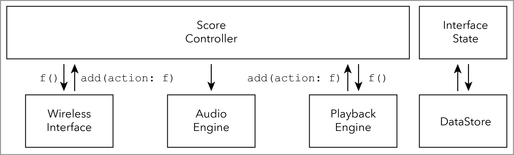

# `ScoreController`

The `ScoreController` allows the user to interact with the `ScoreModelLayer` in order to update the graphical representation of their score in the `ScoreViewLayer`.

## Dependencies

The `ScoreController` requires the `AbstractMusicalModel`, [`ScoreModelLayer`](ScoreModelLayer.md), and the [`ScoreViewLayer`](ScoreViewLayer.md) APIs.

## Organizational diagram



## API

```Swift
final class ScoreController {

	// MARK: - Instance Properties

	// MARK: - Initializers

	init(abstractMusicalModel: AbstractMusicalModel)

	// MARK: - Instance Methods

	func didBeginSelection(_ selection: Selection)
	func didCompleteSelection(_ selection: Selection)
}
```

## Pseudo-implementation

```Swift
final class ScoreController {
	
	// MARK: - Nested Types

	private struct DataStore {
		func writeToUserInterfaceStateDataStore()
		func readFromUserInterfaceStateDataStore()
	}

	private struct Selection {
		let start: Point
		let end: Point
	}

	// manage stateful Selection construction

	private var scoreRange: ScoreRange

	private var userInterfaceState: UserInterfaceState
	private var musicSpacingModel: MusicSpacingModel

	private var model: ScoreModel
	private var view: ScoreViewLayer

	// MARK: - Initializers

	init(abstractMusicalModel: AbstractMusicalModel) { 
		self.model = ScoreModelLayer(abstractMusicalModel: AbstractMusicalModel)
		self.view = ScoreViewLayer(scoreModel: model)
		retrievePersistentState()
	}

	// MARK: - UI

	func didMakeAnnotation(_ annotation: ScoreAnnotation)
	func didMakeFilter(_ filter: ScoreFilter)
	func didMakeOrdering(_ ordering: ScoreOrdering)


	func didCompleteSelection(selection: Selection) { }
	private func scoreRange(from selection: Selection) { }
} 

struct UserInterfaceState {
	// zoom, music-spacing
}
```

