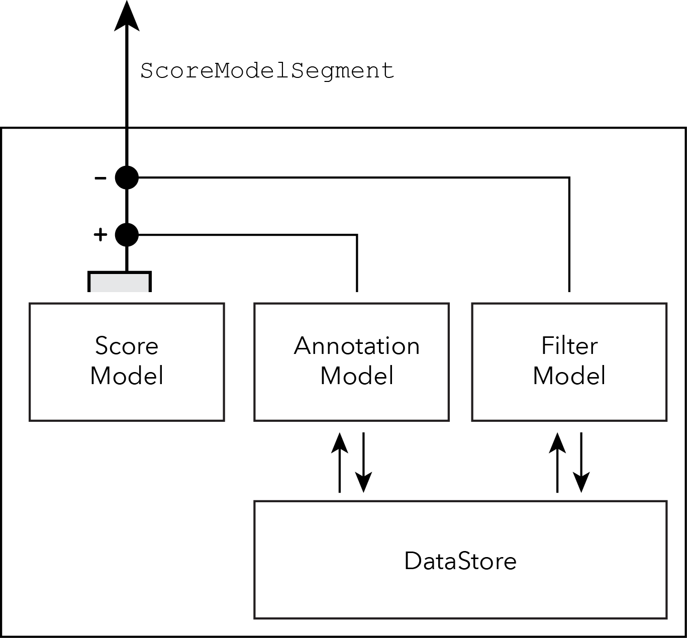

# `ScoreModelLayer`

The `ScoreModelLayer` encapsulates abstract information of a work of music, as well as user-initiated modifications to it.

A performer may interact with the semantic construction of a score in three ways:

- **ScoreFilter** out attributes of any part
- Add a number of different types of **annotations**
- Redefine the **ordering** of parts

The `ScoreModelLayer` stores these modifications, presents an updated model of the score when needed, and writes the updates to disk.

The only logical product of the model layer is a `ScoreModelSegment`, which is an abstract representation of the graphical objects comprising a `System`'s-worth of music. The objects contained within the `ScoreModelSegment` are knowledgeable of "musical time", but not their horizontal placement.

## Dependencies

The `ScoreModelLayer` requires the `AbstractMusicalModel` API.

## Organizational diagram



## API

```Swift
final class ScoreModelLayer {
	
	// MARK: - Initializers

	init(abstractMusicalModel: AbstractMusicalModel)
	
	// MARK: - Instance Methods

	func segment(in range: ScoreRange) -> ScoreModelSegment
    func add(_ filter: ScoreFilter)
    func remove(_ filter: ScoreFilter)
    func add(_ annotation: ScoreAnnotation)
    func remove(_ annotation: ScoreAnnotation)
    func add(_ ordering: ScoreOrdering)
    func remove(_ ordering: ScoreOrdering)
}
```

## Pseudo-implementation


```Swift
final class ScoreModelLayer {

    // MARK: - Nested Types

    /// Abstract representation of graphical objects of a System's worth of music.
    /// Extends the ScoreModel with a model of managing Spanner type objects over System-breaks.
    /// Objects contained herein are organized in "time", not in horizontal space.
    /// This is the only public product of the `ScoreModelLayer`.
    struct ScoreModelSegment {

    	init(scoreModel: ScoreModel, range: ScoreRange) {
    		...
    	}

        /// - returns: Copy of `self` with filters applied
    	func filtered(with filters: FilterModel) -> ScoreModelSegment {
    		...
    	}

    	/// - returns: Copy of `self` with annotations added
        func annotated(with annotations: AnnotationModel) -> ScoreModelSegment {
            ...
        }

        /// - returns: Copy of `self` with components ordered
        func ordered(with orderings: OrderingModel) -> ScoreModelSegment {
            ...
        }
    }

    /// Abstract representation of graphical objects comprising a full score.
    /// This model has no knowledge of system breaks.
    /// Objects contained herein are organized in "time", not in horizontal space.
    private class ScoreModel {

        init(_ abstractMusicalModel: AbstractMusicalModel) {
            ...
        }

		/// - returns: Subset of `self` in a given range.
        func segment(in range: ScoreRange) -> ScoreModelSegment {
        	...
        }

        /// - returns: Subset of `self` in a given range, with the given `annotations` merged.
        func segment(
            in range: ScoreRange, 
            annotations: AnnotationModel, 
            filters: FilterModel,
            orderings: OrderingModel
        ) -> ScoreModelSegment 
        {
            return segment(in: range)
            	.annotated(with: annotations)
            	.filtered(with: filters)
                .ordered(with: orderings)
        }
    }

    /// Protocol abstracting implementation for FilterModel, AnnotationModel, and OrderingModel.
    private protocol UserStateModel {
    	associatedtype Element
    	var backingModel: UserStateBackingModel<Element> { get }
    	func add(_ element: T)
    	func remove(_ element: T)
    }

    /// Data structure holding overlapping ranges of filters (hide c for a:b in (t0,t1)).
    private struct FilterModel: UserStateModel {
        let backingModel: ...
    }

    /// Data structure holding annotations (bowings, fingerings, cue links).
    private struct AnnotationModel: UserStateModel {
        let backingModel: ...
    }

	/// Data structure holding score-order selections.
    private struct OrderingModel: UserStateModel {
    	let backingModel: ...
    }

    /// Reads and writes persisting user state from/to disk on background thread.
    /// Files: filters.xxx, annotations.xxx, orderings.xxx
    private struct DataStore {
        func writeToFilterDataStore() { }
        func readFromFilterDataStore() { }
        func writeToAnnotationDataStore() { }
        func readFromAnnotationDataStore() { }
        func writeToOrderingDataStore() { }
        func readFromOrderingDataStore() { }
    }

    // MARK: - Instance Properties

    private let dataStore: DataStore

    private var filters: FilterModel
    private var annotations: AnnotationModel
    private var orderings: OrderingModel

    private let scoreModel: ScoreModel 

    // MARK: - Initializers

    init(abstractMusicalModel: AbstractMusicalModel) {
        self.scoreModel = ScoreModel(abstractMusicalModel)
    }

    // MARK: - Instance Methods

    func segment(in range: ScoreRange) -> ScoreModelSegment {
        return scoreModel.segment(
            in: range, 
            annotations: annotations, 
            filters: filters
            orderings: orderings
        )
    }

    // MARK: - Modifying Model

    func add(_ filter: ScoreFilter) {
        filters.add(filter)
        writeToFilterDataStore()
    }

    func remove(_ filter: ScoreFilter) { 
        filters.remove(filter)
        writeToFilterDataStore()
    }

    func add(_ annotation: ScoreAnnotation) { 
        annotations.add(annotation)
        writeToAnnotationDataStore()
    }

    func remove(_ annotation: ScoreAnnotation) { 
        annotations.remove(annotation)
        writeToAnnotationDataStore()
    }

    func add(_ ordering: ScoreOrdering) { 
        annotations.add(ordering)
        writeToOrderingDataStore()
    }

    func remove(_ ordering: ScoreOrdering) { 
        annotations.remove(ordering)
        writeToOrderingDataStore()
    }
}

// MARK: - Types

public struct ScoreAnnotation { }
public struct ScoreFilter { }
public struct ScoreOrdering { }
```